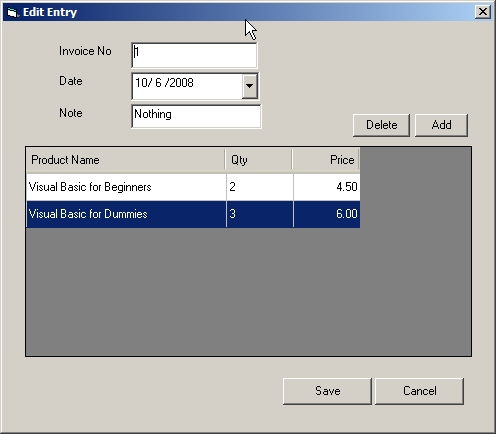



## A Master/Detail form with combobox in Grid \(lynxgrid\)

### Description

A powerful grid which was abandoned by the original author (Richard Mewett). As said by Morgan Haueisen "this grid is too good to let die". Now I want to support this grid as most of my application is using this for my master/detail and or parent/child form. This grid can support also any control which in my case I added a multi-column combobox.

The primary purpose of this code is to learn how to integrate combobox and other control like datepicker, checkbox, etc. in lynxgrid. You will also learn in different way on how to save using a master/detail form. How to delete record in table which was deleted in lynxgrid control.
 
### More Info
 

             |
---                |---
**Submitted On**   |2008-10-08 16:44:54
**By**             |[jaypabs](https://github.com/Planet-Source-Code/PSCIndex/blob/master/ByAuthor/jaypabs.md)
**Level**          |Intermediate
**User Rating**    |5.0 (10 globes from 2 users)
**Compatibility**  |VB 6\.0
**Category**       |[Databases/ Data Access/ DAO/ ADO](https://github.com/Planet-Source-Code/PSCIndex/blob/master/ByCategory/databases-data-access-dao-ado__1-6.md)
**World**          |[Visual Basic](https://github.com/Planet-Source-Code/PSCIndex/blob/master/ByWorld/visual-basic.md)
**Archive File**   |[Master\_Det2129681082008\.zip](https://github.com/Planet-Source-Code/jaypabs-a-master-detail-form-with-combobox-in-grid-lynxgrid__1-71190/archive/master.zip)

